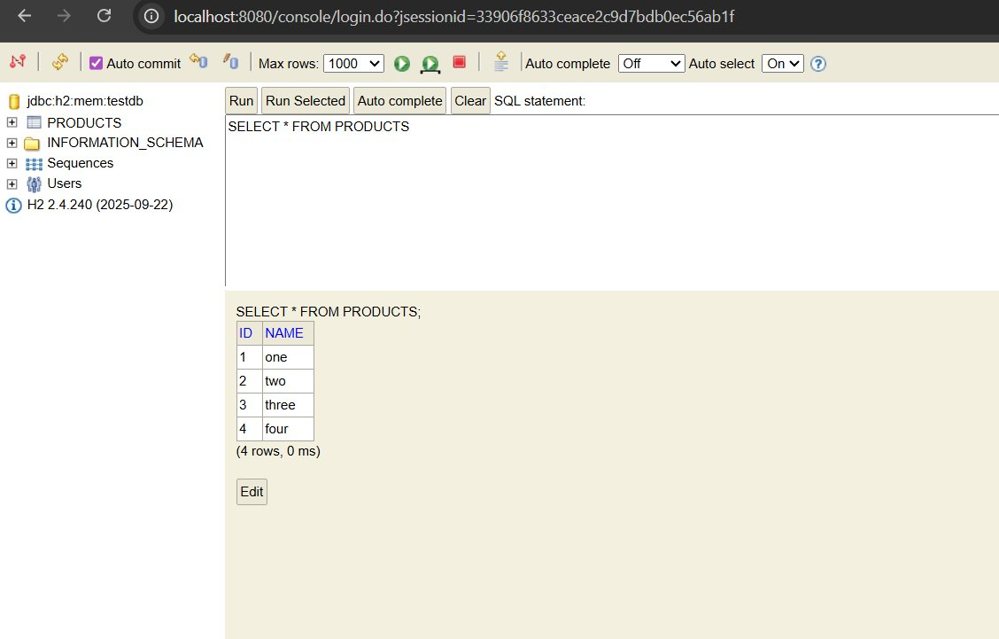
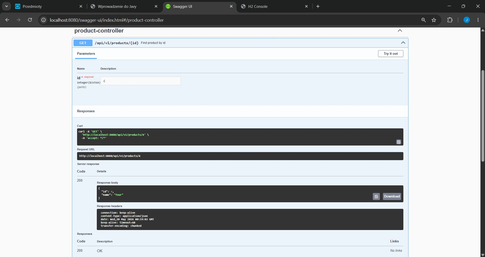
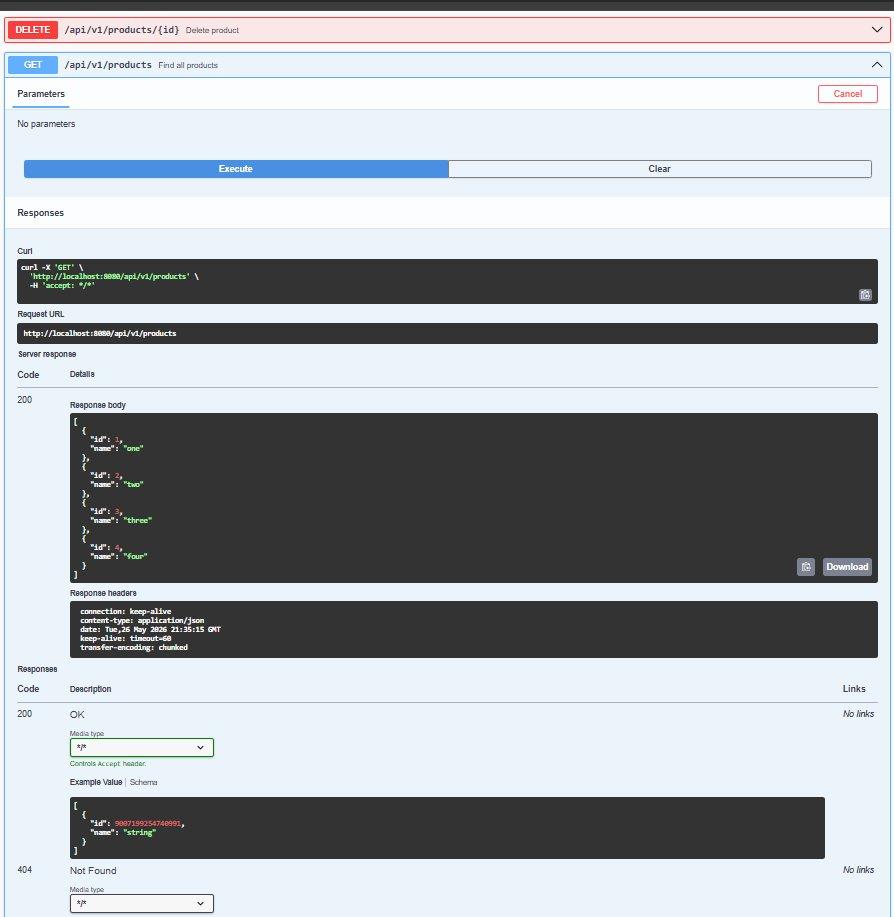
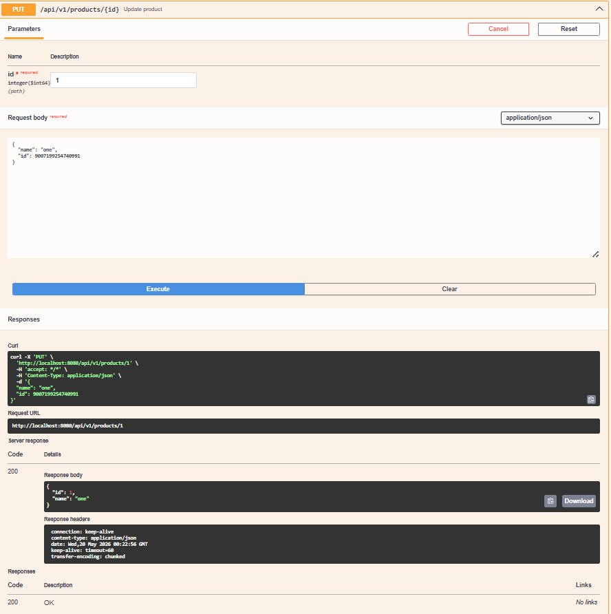
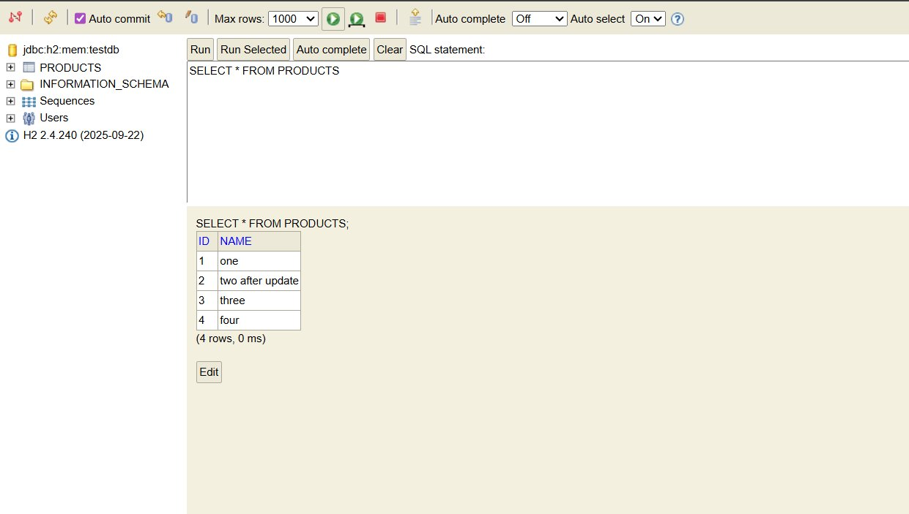
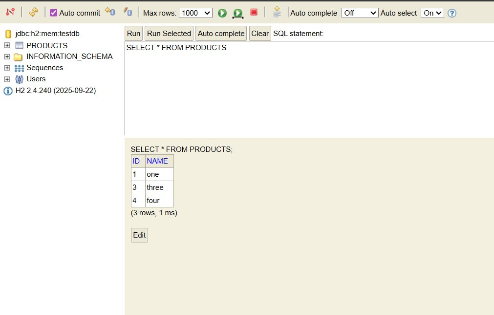
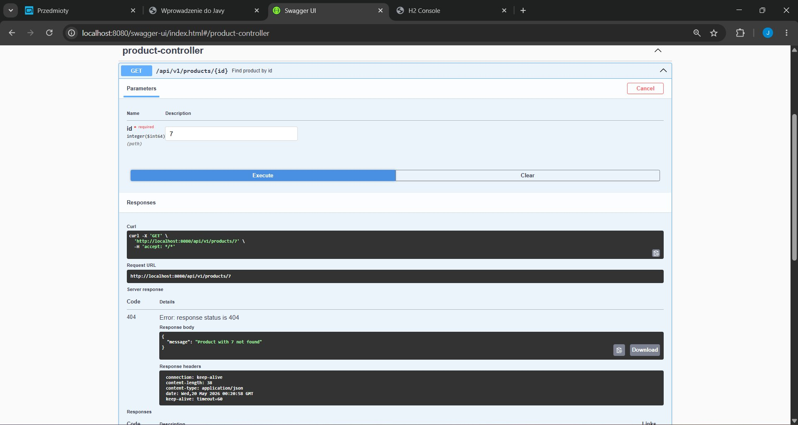
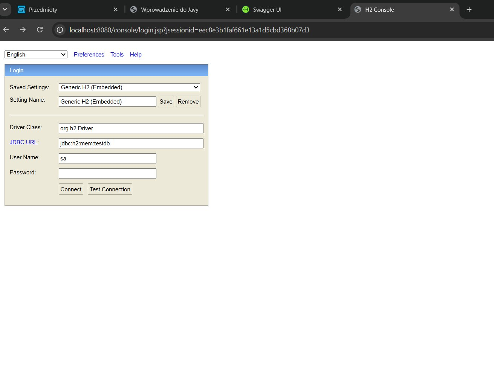

# First REST API - Spring Boot

A RESTful API built with **Spring Boot**, **Spring Data JPA**, and **H2 in-memory database**.  
This project was created as part of the Spring Framework course at Akademia Finansów i Biznesu Vistula.

---

## Table of Contents

- [Technologies Used](#technologies-used)
- [Project Structure](#project-structure)
- [How to Run](#how-to-run)
- [API Endpoints](#api-endpoints)
    - [POST – Create a Product](#1-post--create-a-product)
    - [GET – Find Product by ID](#2-get--find-product-by-id)
    - [GET – Find All Products](#3-get--find-all-products)
    - [PUT – Update a Product](#4-put--update-a-product)
    - [DELETE – Delete a Product](#5-delete--delete-a-product)
- [Exception Handling](#exception-handling)
- [Swagger UI](#swagger-ui)
- [H2 Database Console](#h2-database-console)

---

## Technologies Used

| Technology | Description |
|---|---|
| Java 17 | Programming language |
| Spring Boot | Application framework |
| Spring Web (MVC) | HTTP request handling |
| Spring Data JPA | Database abstraction layer |
| Hibernate | ORM framework |
| H2 Database | In-memory database (used for development/testing) |
| Springdoc OpenAPI (Swagger UI) | API documentation and testing |
| Maven | Build tool |

---

## Project Structure

```
src/main/java/
└── product/
    ├── api/
    │   ├── request/
    │   │   ├── ProductRequest.java       # Handles incoming POST request body
    │   │   └── UpdateProductRequest.java # Handles incoming PUT request body
    │   ├── response/
    │   │   └── ProductResponse.java      # Shapes the outgoing JSON response
    │   └── ProductController.java        # Receives HTTP requests, sends responses
    ├── domain/
    │   └── Product.java                  # JPA entity mapped to the database table
    ├── repository/
    │   └── ProductRepository.java        # Extends JpaRepository for DB operations
    ├── service/
    │   └── ProductService.java           # Business logic layer
    └── support/
        ├── exception/
        │   └── ProductNotFoundException.java      # Custom exception
        ├── ProductExceptionSupplier.java          # Supplies exceptions
        ├── ProductExceptionAdvisor.java           # @ControllerAdvice handler
        └── ProductMapper.java                     # Maps between objects
```

---

## How to Run

### Prerequisites

- Java 17 (or compatible version) installed
- IntelliJ IDEA (or any Java IDE)
- Maven (bundled with IntelliJ)

### Steps

1. **Clone the repository:**
   ```bash
   git clone https://github.com/jassmeenn01/First-Rest-Api-Spring
   ```

2. **Open the project** in IntelliJ IDEA via `File → Open`

3. **Reload Maven dependencies:**  
   Right-click `pom.xml` → Maven → Reload Project

4. **Run the application:**  
   Click the green ▶ Run button, or run:
   ```bash
   ./mvnw spring-boot:run
   ```

5. The application starts on **`http://localhost:8080`**

---

## API Endpoints

Base URL: `http://localhost:8080/api/v1/products`

All requests and responses use **JSON format**.

All available endpoints visible in Swagger UI:


---

### 1. POST – Create a Product

**URL:** `POST /api/v1/products`  
**Description:** Creates a new product and saves it to the database.  
**Response status:** `201 Created`

**Request body:**
```json
{
  "name": "one"
}
```

**Response body:**
```json
{
  "id": 1,
  "name": "one"
}
```

After creating 4 products (one, two, three, four), the H2 database shows:



---

### 2. GET – Find Product by ID

**URL:** `GET /api/v1/products/{id}`  
**Description:** Returns a single product by its ID.  
**Response status:** `200 OK`

**Example request:**
```
GET http://localhost:8080/api/v1/products/4
```

**Response body:**
```json
{
  "id": 4,
  "name": "four"
}
```

**Successful response (200 OK) tested in Swagger UI:**



---

### 3. GET – Find All Products

**URL:** `GET /api/v1/products`  
**Description:** Returns a list of all products in the database.  
**Response status:** `200 OK`

**Example request:**
```
GET http://localhost:8080/api/v1/products
```

**Response body:**
```json
[
  { "id": 1, "name": "one" },
  { "id": 2, "name": "two" },
  { "id": 3, "name": "three" },
  { "id": 4, "name": "four" }
]
```

> If no products exist, an empty list `[]` is returned — no exception is thrown.

**GET all products tested in Swagger UI (200 OK):**



---

### 4. PUT – Update a Product

**URL:** `PUT /api/v1/products/{id}`  
**Description:** Updates the name of an existing product by its ID.  
**Response status:** `200 OK`

**Example request:**
```
PUT http://localhost:8080/api/v1/products/2
```

**Request body:**
```json
{
  "name": "two after update",
  "id": 2
}
```

**Response body:**
```json
{
  "id": 2,
  "name": "two after update"
}
```

**PUT request tested in Swagger UI (200 OK):**



**H2 database after the update — product id=2 name changed to "two after update":**



---

### 5. DELETE – Delete a Product

**URL:** `DELETE /api/v1/products/{id}`  
**Description:** Deletes a product by its ID. Returns no content on success.  
**Response status:** `204 No Content`

**Example request:**
```
DELETE http://localhost:8080/api/v1/products/2
```

**Response:** No body is returned. Status `204 No Content` confirms the deletion.

**DELETE request tested in Swagger UI (204 No Content):**


**H2 database after DELETE — product id=2 is gone, only 3 rows remain:**



---

## Exception Handling

If you request a product ID that does not exist, instead of a generic `500 Internal Server Error`, the API returns a descriptive `404 Not Found` response.

**Example — requesting a non-existent product (id = 7):**
```
GET http://localhost:8080/api/v1/products/7
```

**Response (404 Not Found):**
```json
{
  "message": "Product with 7 not found"
}
```

This is handled by the `ProductExceptionAdvisor` class annotated with `@ControllerAdvice`, which catches `ProductNotFoundException` and returns the correct HTTP status and error message.

**404 error response shown in Swagger UI:**



---

## Swagger UI

Swagger UI provides an interactive interface to view and test all API endpoints without needing Postman.

**URL:** [`http://localhost:8080/swagger-ui/index.html`](http://localhost:8080/swagger-ui/index.html)

All available endpoints are listed under the `product-controller` section:


Features:
- All 5 endpoints visible (GET by id, PUT, DELETE, GET all, POST)
- Request/response schemas (`ProductRequest`, `UpdateProductRequest`, `ProductResponse`, `ErrorMessageResponse`)
- Ability to execute requests directly from the browser using "Try it out"

**Raw API docs (JSON format):**  
[`http://localhost:8080/v3/api-docs`](http://localhost:8080/v3/api-docs)

---

## H2 Database Console

H2 is an in-memory database used during development. Data is stored only while the application is running.

**URL:** [`http://localhost:8080/console`](http://localhost:8080/console)

**Login settings:**

| Field | Value |
|---|---|
| JDBC URL | `jdbc:h2:mem:testdb` |
| User Name | `sa` |
| Password | *(leave empty)* |

**H2 Console login screen:**



After logging in, you can run SQL queries directly against the database:

```sql
SELECT * FROM PRODUCTS;
```

**H2 Console after creating 4 products:**


**H2 Console after updating product id=2:**


**H2 Console after deleting product id=2:**


---

## Author

**Jasmeen Kaur**  
Vistula University  


